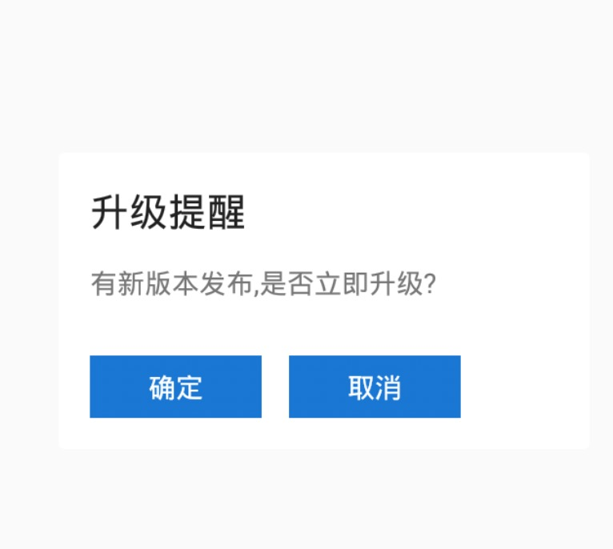

App Update插件，集成到项目里，快速实现App自动升级提醒并下载最新安装包；
截图：

IMetaModelParse metaModelParse = new IMetaModelParse() {

    @Override
    public MetaModel parse(String data) {
        return new CustomMeta();
    }
};

Config config = new Config.Builder()

        .addContext(this)
        .addUpdateUrl("http://update.url")
        .addIMetaModelParse(metaModelParse)
        .builder();
AutoUpdateFactory.getInstance().getPresenter(config).start();

class CustomMeta implements MetaModel {

        @Override
        public int getVersionCode() {
            return 0;
        }

        @Override
        public String getContent() {
            return "有新版本发布,是否立即升级?";
        }

        @Override
        public String getTitle() {
            return "升级提醒";
        }

        @Override
        public String getVersionName() {
            return null;
        }

        @Override
        public String getDownloadUrl() {
            return "http://update.apk";
        }
    }
